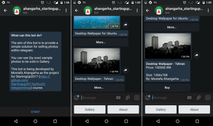

# telegramShop
The objective in the 3rd week is to make a Telegram Bot which can show catalog of a shop.
It is up to the developer to choose the products.
## Bots to be made:

### Ahangarha Startingup2017

__Description:__ A bot for selling Photos

__Bot address:__ http://t.me/ahangarha_startingup2017_bot

**ScreenShots:**

### gitys bot

__Bot address:__ http://t.me/gity0bot

__Description:__ A bot for selling perfume products
